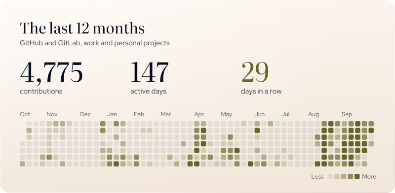

<!-- Carlos's original animated header. Keep the GIF, not a replacement banner. -->

  

  <samp>
    <a href="https://carlosiborra.com">Website</a> &ensp;<a href="https://carlosiborra.com/notes">Notes</a> &ensp;<a href="https://www.linkedin.com/in/carlos-iborra-llopis-bb84a1214/">LinkedIn</a> &ensp;<a href="mailto:contact@carlosiborra.com">Email</a>
  </samp>

  <picture>
    <source media="(prefers-color-scheme: dark)" srcset="assets/slab-hero-dark.svg">
    
  </picture>

Hey 👋 I'm Carlos. I work across **data engineering, AI infrastructure, and developer tools**. Outside work, I build applications, experiment with new technologies, and automate things I'd rather not do twice.

As a kid I wanted to be an inventor. Software became the closest thing I found to it: a place where curiosity and persistence can turn an idea into something real. “I wonder how that works?” is behind most of what I build, much of what I learn, and an unreasonable number of open tabs.

> **The goal:** build useful products, keep learning, and make complex things feel simple.

  <samp>Based in</samp> Madrid, Spain 
  <samp>Studied</samp> Computer Science at Universidad Carlos III de Madrid 
  <samp>Interested in</samp> AI &amp; agents · Web &amp; native apps · Data systems · Developer tools · Build systems · Self-hosting 
  <samp>Working with</samp> Python · TypeScript · SQL · React · PostgreSQL · Docker · Terraform · Linux · Neovim 
  <samp>Exploring</samp> Swift · Rust · Go

  <picture>
    <source media="(prefers-color-scheme: dark)" srcset="assets/slab-stats-dark.svg">
    
  </picture>

  <!-- activity:summary -->
  4,775 contributions · 147 active days · longest streak 29 days. Private and work activity is included and counted anonymously. Updated 2 October 2026.
  <!-- /activity:summary -->

  <samp>Writing</samp> Setups I want to remember, written up as notes:
  <a href="https://carlosiborra.com/notes/configurations/configuring-neovim-ubuntu">Neovim on Ubuntu / WSL</a> ·
  <a href="https://carlosiborra.com/notes/configurations/setting-up-fail2ban-debian-server-with-discord-notifications">Fail2Ban with Discord alerts on Debian</a> ·
  <a href="https://carlosiborra.com/notes">all notes</a>

Beyond the keyboard: running, boxing, and time in the mountains.

