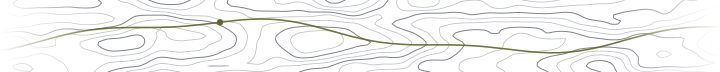

<!-- Carlos's original animated header. Keep the GIF, not a replacement banner. -->

  

<h3 align="center">Carlos Iborra</h3>

  Software &amp; Data Engineer · Madrid,&nbsp;Spain 
  <samp><b>NORMAL</b>&nbsp; main &nbsp;README.md &nbsp;1:1</samp>

  <samp>
    <a href="https://carlosiborra.com">:website</a> &ensp;<a href="https://carlosiborra.com/notes">:notes</a> &ensp;<a href="https://www.linkedin.com/in/carlos-iborra-llopis-bb84a1214/">:linkedin</a> &ensp;<a href="mailto:contact@carlosiborra.com">:email</a>
  </samp>

  <picture>
    <source media="(prefers-color-scheme: dark)" srcset="assets/topo-dark.svg">
    
  </picture>

### Curiosity, put into practice.

Hey 👋 I'm a software engineer working across **data engineering, AI infrastructure, and developer tools**. Outside work, I build applications, experiment with new technologies, and automate things I'd rather not do twice.

As a kid I wanted to be an inventor. Software became the closest thing I found to it: a place where curiosity and persistence can turn an idea into something real. It's my profession, my hobby, and the rabbit hole I happily return to. “I wonder how that works?” is behind most of what I build, much of what I learn, and an unreasonable number of open tabs.

> **The goal:** build useful products, keep learning, and make complex things feel simple.

  <samp>-- DRAWN TO --</samp> 
  AI &amp; agents · Web &amp; native apps · Data systems · Developer tools · Build systems · Self-hosting

  <samp>-- WORKING WITH --</samp> 
  Python · TypeScript · SQL · React · PostgreSQL · Docker · Terraform · Linux · Neovim 
  Also exploring Swift, Rust, and Go.

  <picture>
    <source media="(prefers-color-scheme: dark)" srcset="assets/topo-end-dark.svg">
    
  </picture>

  Beyond the keyboard: running, boxing, and time in the mountains. 
  <samp>:wq</samp>

