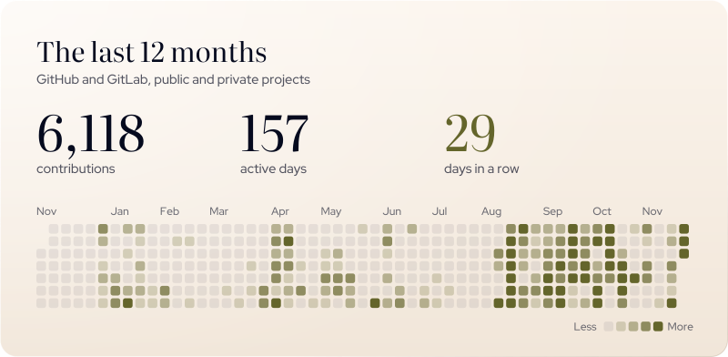

<!-- Carlos's original animated header. Keep the GIF, not a replacement banner. -->

  

  <samp>
    <a href="https://carlosiborra.com">Website</a> &ensp;<a href="https://carlosiborra.com/notes">Notes</a> &ensp;<a href="https://www.linkedin.com/in/carlos-iborra-llopis-bb84a1214/">LinkedIn</a> &ensp;<a href="mailto:contact@carlosiborra.com">Email</a>
  </samp>

  <picture>
    <source media="(prefers-color-scheme: dark)" srcset="assets/slab-hero-dark.svg">
    
  </picture>

Hey 👋 I'm Carlos. As a kid I wanted to be an inventor; software turned out to be the closest thing. I build data systems and AI infrastructure, and in my own time apps and tools that automate whatever I'd rather not do twice.

> **The goal:** build useful things, keep learning, and make complex things feel simple.

  <samp>Based in</samp> Madrid, Spain 
  <samp>Studied</samp> Computer Science, Universidad Carlos III de Madrid 
  <samp>Interested in</samp> AI agents, web and native apps, data systems, developer tools, self-hosting 
  <samp>Working with</samp> Python, TypeScript, SQL, React, PostgreSQL, Docker, Terraform, Linux, Neovim 
  <samp>Exploring</samp> Swift, Rust, Go

  <picture>
    <source media="(prefers-color-scheme: dark)" srcset="assets/slab-stats-dark.svg">
    
  </picture>

  <!-- activity:summary -->
  6,118 contributions, 157 active days, longest streak 29 days. Private activity is included and counted anonymously. Updated 18 November 2026.
  <!-- /activity:summary -->

  <samp>Writing</samp> Setups worth remembering:
  <a href="https://carlosiborra.com/notes/configurations/configuring-neovim-ubuntu">Neovim on Ubuntu and WSL</a>,
  <a href="https://carlosiborra.com/notes/configurations/setting-up-fail2ban-debian-server-with-discord-notifications">Fail2Ban with Discord alerts</a>,
  <a href="https://carlosiborra.com/notes">all notes</a>

Beyond the keyboard: running, boxing, and time in the mountains.

